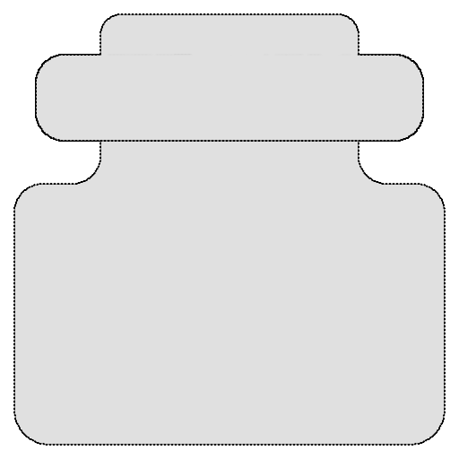
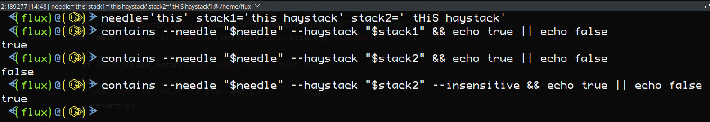
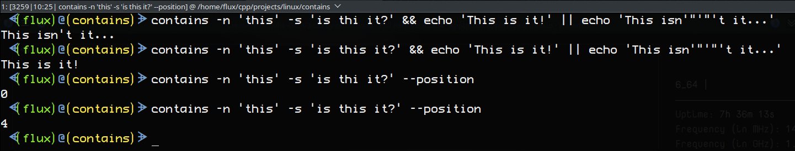

# contains



---

## Description

Check if a hay[stack] contains a [needle] in the command line with some options.

### Disclaimer

Nothing new here, just a different way to do it.

### Motivation

I just like to build tools the way I want them to work. If this works well for you then that's great and I hope you get god use of it.

---

## Usage

### Environment

This is a command line tool that should work in any *shell*/*terminal*/*console*/*tty* in several operating systems.

### Installation

This is a portable application with no dependencies, but the Linux version has a `deb` package installer that provides simple `Bash Completion` and some icons for `hicolor`. If it is not installed it should be placed in your `PATH` in your respective environment. if you don't put in a `PATH` then you will have to run it directly, of course.

Your `PATH`'s can be found in your respective variables per your operating system (of course, you might've added your own directories to the `PATH`:

#### Linux, Android, and Mac OS Path

```Bash
echo $PATH
# or
printf '%s\n' $PATH
```

#### Windows Path

PowerShell

```PowerShell
Write-Host $Env:PATH
```

CMD

```CMD
echo %PATH%
```

### Examples

This is a very simple program that accepts a `-h, --help` switch and strings of of characters and is used the same way regardless of which environment you're in.

Windows Examples

PowerShell:

```PowerShell
# Not in path
& 'C:\Path\To\contains.exe' --needle 'World' --haystack 'Hello World' &&
>> Write-Host True ||
>> Write-Host False
True
# In path
contains -n "World" -s "Hello, You" &&
>> Write-Host True ||
>> Write-Host False
False
# Get character position
contains -n 'b' -s 'abc' --position
2
```

Everything Else Examples

```Bash
# Not in path
 $ /path/to/contains -n PM -s "$(date)" &&
 > printf '%s\n' "Good afternoon." ||
 > printf '%s\n' "Good morning."
Good afternoon.
# In path
contains -n AM -s "$(date)" &&
 > printf '%s\n' "Good afternoon." ||
 > printf '%s\n' "Good morning."
Good morning.
```

Help Screen

```Bash
contains --help
                                                  
 'contains' - Check if a hay[stack] contains a    
 [needle]. This can either return an EXIT_CODE    
 (0 or 1) on found or not or it can PRINT a       
 positional start integer with the 'position'     
 switch.                                          
                                                  
 USAGE:                                           
     contains <SWITCH [PARAMETER]>...             
     if contains -n needle -s stack; then ... fi  
     contains -n needle -s stack && echo found... 
     contains -n needle -s stack --position       
                                                  
 SWITCH:                                          
     -h, --help          This help message.       
     -n, --needle        What to find. [needle]   
     -s, --haystack      Where to look. [stack]   
     -i, --insensitive   Test is case insensitive.
     -p, --position      PRINT the position of the
                         starting character if    
                         found. This changes the  
                         behavior of the program  
                         printing output rather   
                         than returning an exit   
                         code.                    
                                                  
 PARAMETER:                                       
     needle - String of characters to find.       
     stack -  String of characters to look in.    
                        
```

---

## Project Information

This project is written in `C++`.

[![C++](https://img.shields.io/endpoint?url=https://raw.githubusercontent.com/Lateralus138/contains/master/docs/json/cpp.json&logo=data%3Aimage%2Fpng%3Bbase64%2CiVBORw0KGgoAAAANSUhEUgAAABAAAAAQCAMAAAAoLQ9TAAAABGdBTUEAALGPC%2FxhBQAAACBjSFJNAAB6JgAAgIQAAPoAAACA6AAAdTAAAOpgAAA6mAAAF3CculE8AAABcVBMVEUAAAAAgM0Af8wolNQAa7YAbbkAQIcAQIYAVJ0AgM0AgM0AgM0AgM0AgM0AgM0AgM0AgM0AgM0AgM0Af8wAfswAfswAf8wAgM0AgM0AgM0Af80AgM0AgM0AgM0AgM0Af8wAgM0Af80djtIIg84Af8wAfsxYrN4Fg84Gg85RqNwej9MLhM8LhM8AfcsAgM0Hg88AfsshkNNTqd1%2Fv%2BUXi9AHdsAAYKoAY64ih8kAf81YkcEFV54GV55Sj8EnlNULhc8AecYdebwKcrsAe8gAb7oAXacAXqgAcLwAImUAUpoAVJ0AUpwAUZoAIWMAVJ0AVJ0AUpwAUZwAVJ0AVJ0AVJ0AVJ0AgM0cjtJqteGczetqtOEAf807ndjL5fT9%2Fv7%2F%2F%2F%2FM5fQ9ntnu9vu12vCi0Oz%2F%2F%2F6Hw%2Bebzeufz%2Bx%2Bv%2BW12e%2Bgz%2BxqteLu9fmRx%2BjL3Ovu8%2Fi1zeKrzeUAUpw7e7M8fLQAU50cZ6hqm8WcvNgAVJ3xWY3ZAAAAVnRSTlMAAAAAAAAAAAAREApTvrxRCQQ9rfX0qwErleyUKjncOFv%2B%2Fv5b%2Ff7%2B%2Fv7%2B%2Fv1b%2Ff7%2B%2Fv7%2BW%2F7%2B%2Fv79%2Fv7%2B%2Fv7%2B%2Fv7%2B%2Fjfa2jcBKJHqKAEEO6r0CVC8EFaOox4AAAABYktHRF9z0VEtAAAACXBIWXMAAA7DAAAOwwHHb6hkAAAAB3RJTUUH5QYKDQws%2FBWF6QAAAONJREFUGNNjYAABRkZOLkZGBhhgZOTm4eXjF4AJMQoKCYuEhYmKCQmCRBjFJSSlwiMiI6PCpaRlxBkZGGXlomNi4%2BLj4xISo%2BXkgQIKikqx8UnJyUnxKcqKKiAB1ajUJDV1Dc00LW0dXSaggF56fLK%2BgYFhhlGmsQkzRCDL1MzcIhsmYJkTn2tlbWObZ2cP0sKk4OCYH19QWFgQX%2BTkrMLEwOLiWlySD7I2v7TMzZ2Vgc3D08u7vKKysqLc28vHlx3oVg4%2F%2F4DAqqrAAH8%2FDohnODiCgkNCgoM4OOD%2B5eAIDYVyAZ9mMF8DmkLwAAAAJXRFWHRkYXRlOmNyZWF0ZQAyMDIxLTA2LTEwVDE4OjEyOjQ0LTA1OjAwkjvGQgAAACV0RVh0ZGF0ZTptb2RpZnkAMjAyMS0wNi0xMFQxODoxMjo0NC0wNTowMONmfv4AAAAASUVORK5CYII%3D)](http://www.cplusplus.org/)


|Description|Status|
|:---:|:---:|
|Project Release Date||
|Total downloads for this project||
|Complete repository size||
|Commits in last month||
|Commits in last year||

Latest Version Status

|Description|Status|Number of Downloads|
|:---:|:---:|:---:|
|Latest Release version|||
|Latest Tag version, possible Pre-Release's|||

### File Information

All current compiled files and the source of this project can be found at this repository in the **`Releases`** section under **`Stable Release`** and can be found in 32 (*X86*) and 64 (*X64*) bit format for *Windows* and 64 bit otherwise.

You may want to rename any of the provided executables to `contains` (or `contains.exe`).

***This is the recommended method of download.***

[![CR](https://img.shields.io/endpoint?url=https://raw.githubusercontent.com/Lateralus138/contains/master/docs/json/current_releases.json&logo=data%3Aimage%2Fpng%3Bbase64%2CiVBORw0KGgoAAAANSUhEUgAAABAAAAAQCAMAAAAoLQ9TAAAABGdBTUEAALGPC%2FxhBQAAACBjSFJNAAB6JgAAgIQAAPoAAACA6AAAdTAAAOpgAAA6mAAAF3CculE8AAABcVBMVEUAAAAAgM0Af8wolNQAa7YAbbkAQIcAQIYAVJ0AgM0AgM0AgM0AgM0AgM0AgM0AgM0AgM0AgM0AgM0Af8wAfswAfswAf8wAgM0AgM0AgM0Af80AgM0AgM0AgM0AgM0Af8wAgM0Af80djtIIg84Af8wAfsxYrN4Fg84Gg85RqNwej9MLhM8LhM8AfcsAgM0Hg88AfsshkNNTqd1%2Fv%2BUXi9AHdsAAYKoAY64ih8kAf81YkcEFV54GV55Sj8EnlNULhc8AecYdebwKcrsAe8gAb7oAXacAXqgAcLwAImUAUpoAVJ0AUpwAUZoAIWMAVJ0AVJ0AUpwAUZwAVJ0AVJ0AVJ0AVJ0AgM0cjtJqteGczetqtOEAf807ndjL5fT9%2Fv7%2F%2F%2F%2FM5fQ9ntnu9vu12vCi0Oz%2F%2F%2F6Hw%2Bebzeufz%2Bx%2Bv%2BW12e%2Bgz%2BxqteLu9fmRx%2BjL3Ovu8%2Fi1zeKrzeUAUpw7e7M8fLQAU50cZ6hqm8WcvNgAVJ3xWY3ZAAAAVnRSTlMAAAAAAAAAAAAREApTvrxRCQQ9rfX0qwErleyUKjncOFv%2B%2Fv5b%2Ff7%2B%2Fv7%2B%2Fv1b%2Ff7%2B%2Fv7%2BW%2F7%2B%2Fv79%2Fv7%2B%2Fv7%2B%2Fv7%2B%2Fjfa2jcBKJHqKAEEO6r0CVC8EFaOox4AAAABYktHRF9z0VEtAAAACXBIWXMAAA7DAAAOwwHHb6hkAAAAB3RJTUUH5QYKDQws%2FBWF6QAAAONJREFUGNNjYAABRkZOLkZGBhhgZOTm4eXjF4AJMQoKCYuEhYmKCQmCRBjFJSSlwiMiI6PCpaRlxBkZGGXlomNi4%2BLj4xISo%2BXkgQIKikqx8UnJyUnxKcqKKiAB1ajUJDV1Dc00LW0dXSaggF56fLK%2BgYFhhlGmsQkzRCDL1MzcIhsmYJkTn2tlbWObZ2cP0sKk4OCYH19QWFgQX%2BTkrMLEwOLiWlySD7I2v7TMzZ2Vgc3D08u7vKKysqLc28vHlx3oVg4%2F%2F4DAqqrAAH8%2FDohnODiCgkNCgoM4OOD%2B5eAIDYVyAZ9mMF8DmkLwAAAAJXRFWHRkYXRlOmNyZWF0ZQAyMDIxLTA2LTEwVDE4OjEyOjQ0LTA1OjAwkjvGQgAAACV0RVh0ZGF0ZTptb2RpZnkAMjAyMS0wNi0xMFQxODoxMjo0NC0wNTowMONmfv4AAAAASUVORK5CYII%3D)](https://github.com/Lateralus138/contains/releases/tag/1.0.0)

You can, of course, build, fork, and/or download the source of this project as per the [LICENSE](./LICENSE) of this project. If you want me to create a build for a different architecture and don't want to do it yourself then just let me know what you need and I'll look into it.

### MD5

These MD5 values are evaluated immediately after the build.

Windows X86 MD5


Windows X64 MD5


Linux MD5


Debian MD5


Android MD5


---

## Media

### Logo

A simple little logo I created in *Glimpse* (new verion of GIMP).

This is in the *Windows* executables and is installed with the *hicolor* theme with the *Linux* *.deb* installer.


### Screenshot Demos






---

## [LICENSE](./LICENSE)


>This program is free software: you can redistribute it and/or modify it under the terms of the GNU General Public License as published by the Free Software Foundation, either version 3 of the License, or (at your option) any later version.

>This program is distributed in the hope that it will be useful, but WITHOUT ANY WARRANTY; without even the implied warranty of MERCHANTABILITY or FITNESS FOR A PARTICULAR PURPOSE.  See the GNU General Public License for more details.

>...
